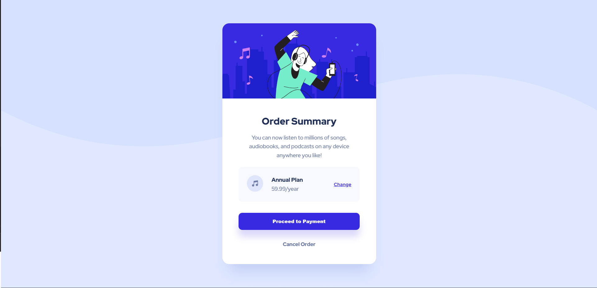

# Frontend Mentor - Order summary card solution

## Overview

### The challenge

Users should be able to:

- See hover states for interactive elements

### Screenshot

- Solution URL: [Solution URL here](https://github.com/unaygney/order-summary-component)
- Live Site URL: [Live site URL here](https://unaygney.github.io/order-summary-component/)
